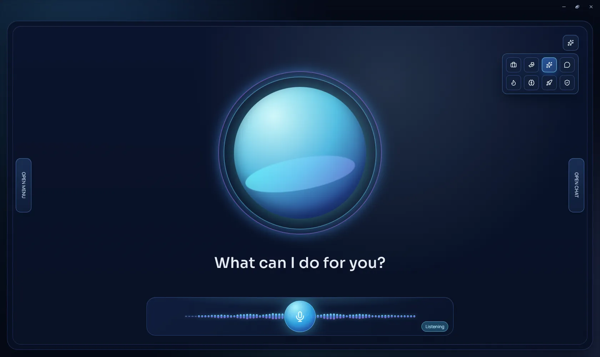
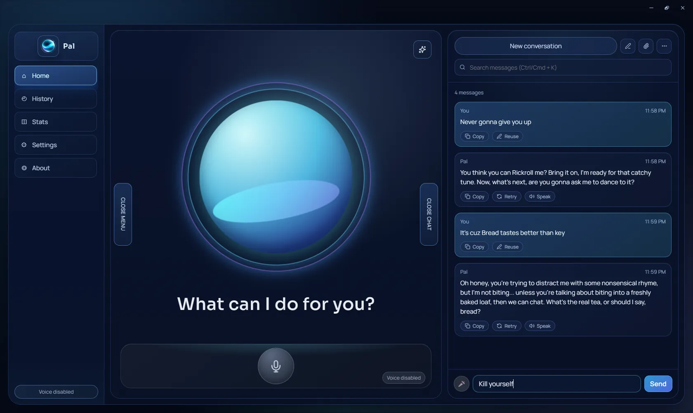
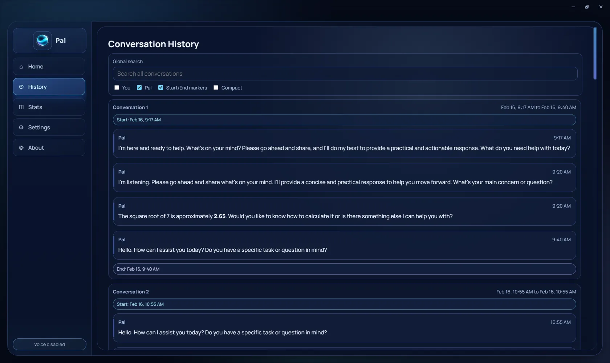
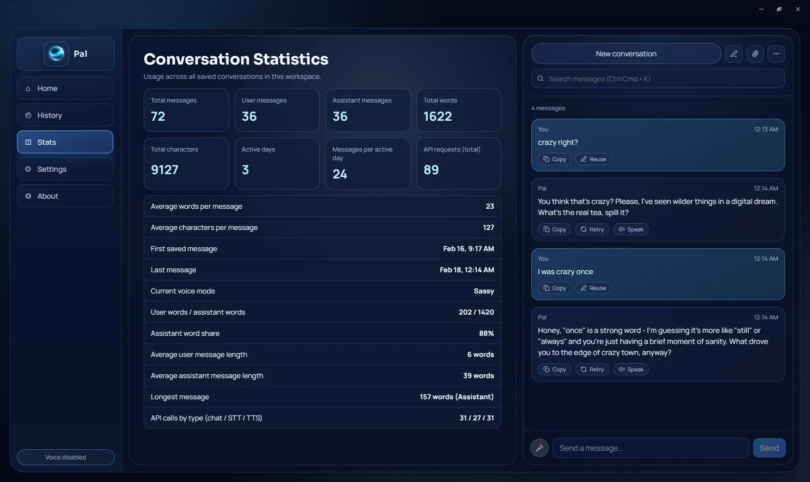
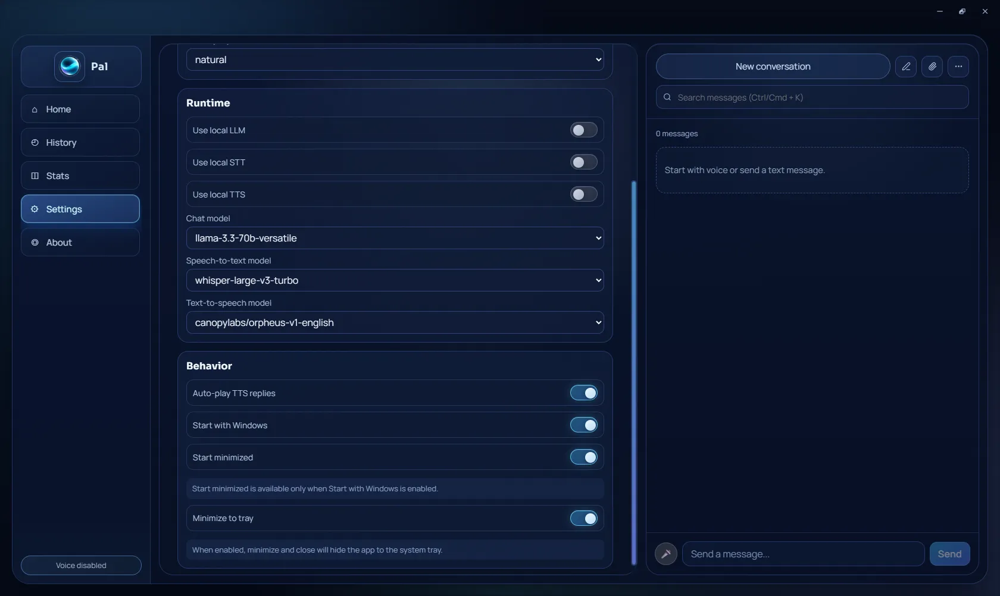
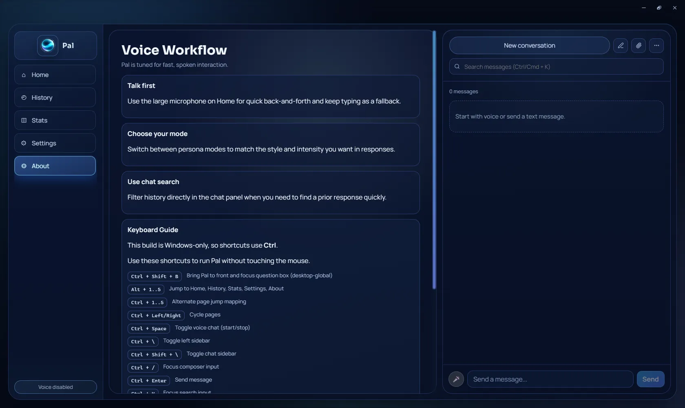

<h1 style="font-family: Arial, sans-serif; font-size: 36px; color: #6cb4ec; display: flex; align-items: center; border-bottom: 3px solid #6cb4ec; padding-bottom: 5px;">
    
    PAL - Personal AI Launcher
</h1>
PAL is your desktop co-pilot: fast voice chat, sharp text reasoning, and a clean Tauri-native experience that stays close to your workflow instead of living in a browser tab.

**Status:** Phase 1 (voice/text assistant, tray, shortcuts, start-with-OS) and the fully-local LLM/STT/TTS stack (2.0) are complete and working, with a clean, up-to-date working tree. Phase 2 items — more local runtime options, deeper mode customization, session memory — are still open.

---

## Tech Used 🧑‍💻


---

## Core Features ⚡

* 🎙️ **Voice-First Assistant:**
    Talk naturally with PAL using live voice input and spoken output.

* 💬 **Text + Voice Hybrid Chat:**
    Switch between typing and speaking without breaking the conversation flow.

* 🧠 **Multiple Assistant Modes:**
    Different personalities/work modes for different tasks.

* 🕘 **History + Stats:**
    Track past chats and usage analytics from inside the app.

* ⌨️ **Global Shortcuts + Tray Control:**
    Summon PAL quickly, then hide/show/quit from the system tray.

* 💾 **Persistent Local Settings:**
    Startup behavior, preferences, and app state are saved locally.

* 🖥️ **Desktop-Native Performance:**
    Tauri + Rust backend for a lightweight, responsive experience.

---

## Screenshots 📸

<br>


**Voice Screen:** Push-to-talk and conversational voice pipeline for fast hands-free interaction.

<br>


**Chat Screen:** Structured responses, markdown support, and focused conversation layout.

<br>


**History Screen:** Jump back into previous sessions instantly.

<br>


**Stats Screen:** Lightweight analytics to understand how you use PAL.

<br>


**Settings Screen:** Configure startup, models, voice behavior, and app preferences.

<br>


**About Screen:** Quick project overview and build context.

---

## Runtime Modes 🧪

Every stage can run on-device or in the cloud, toggled independently in
Settings. Mix freely — local chat with cloud speech is a valid setup.

| Toggle | Local engine | Cloud engine |
|--------|--------------|--------------|
| `LOCAL_LLM` | Gemma 3 (llama.cpp) | `llama-3.3-70b-versatile` |
| `STT_LOCAL` | Whisper large-v3-turbo (whisper.cpp) | `whisper-large-v3-turbo` |
| `TTS_LOCAL` | Kokoro-82M (ONNX Runtime) | `canopylabs/orpheus-v1-english` |

Local chat and transcription run as supervised child processes that expose
HTTP APIs; Rust owns their lifecycle and reaps them on exit. Kokoro runs
in-process via ONNX Runtime.

Measured on an RTX 4070 Laptop (8 GB):

| Workload | Throughput |
|----------|-----------|
| Gemma 3 4b q4_0, CUDA | ~50 tok/s |
| Gemma 3 4b q4_0, CPU | ~9.6 tok/s |
| Gemma 3 1b q4_0, CPU | ~30 tok/s |
| Whisper large-v3-turbo q5_0 | 11 s audio in 0.77 s |

> Vulkan measured ~0.8 tok/s on this hardware — 12x slower than CPU — so the
> CUDA build is used. Machines without an NVIDIA GPU fall back to CPU
> automatically; llama.cpp and whisper.cpp both ship CPU backends alongside.

---

## Project Structure

```plaintext
/ (root)
├── README.md
├── package.json
├── vite.config.ts
├── screenshots/            # App screenshots used in this README
├── public/                 # Static assets (including PAL icon)
├── src/                    # React + TypeScript frontend
│   ├── components/
│   ├── routes/
│   ├── services/
│   ├── styles/
│   ├── App.tsx
│   └── main.tsx
├── scripts/
│   └── fetch-backend.ps1   # Downloads the local inference payloads
├── src-tauri/              # Rust + Tauri desktop backend
│   └── src/
│       ├── server.rs       # Shared child-process supervision
│       ├── llm.rs          # llama.cpp lifecycle
│       ├── stt.rs          # whisper.cpp lifecycle
│       └── tts.rs          # Kokoro ONNX inference
└── backend/                # Local model payloads (untracked, fetched)
    ├── lib/                # llama-server + CUDA redistributables
    ├── weights/            # Gemma 3 GGUF weights
    ├── whisper/            # whisper-server + model
    └── tts/                # Kokoro ONNX, voices, espeak-ng
```

---

## Setup and Development 🛠️

1. **Prerequisites:**
   - Node.js (v18+)
   - Rust toolchain
   - Tauri CLI
   - NVIDIA GPU + driver (optional — enables CUDA; CPU works without it)

2. **Install dependencies:**
   ```sh
   pnpm install
   ```

3. **Fetch the local inference runtime:**
   Downloads llama.cpp, whisper.cpp, Gemma 3, Whisper and Kokoro into
   `backend/` against pinned releases with checksum verification. These are
   deliberately untracked — roughly 6 GB in total.
   ```sh
   pwsh -File scripts/fetch-backend.ps1
   ```
   Pass `-SkipWeights` to fetch only the runtimes.

4. **Configure environment:**
   Create/update `src/.env`:
   ```env
   LOCAL_LLM=false
   TTS_LOCAL=false
   STT_LOCAL=false

   VITE_GROQ_API_KEY=your_groq_key
   VITE_GROQ_BASE_URL=https://api.groq.com/openai/v1
   VITE_GROQ_CHAT_MODEL=llama-3.3-70b-versatile
   VITE_GROQ_STT_MODEL=whisper-large-v3-turbo
   VITE_GROQ_TTS_MODEL=canopylabs/orpheus-v1-english
   VITE_GROQ_TTS_VOICE=troy

   # Optional local overrides
   VITE_LOCAL_LLM_MODEL=gemma-3-4b-it-q4_0
   VITE_LOCAL_LLM_PORT=8080
   VITE_LOCAL_STT_PORT=8081
   ```

   > Only the `VITE_GROQ_*` values matter for cloud mode; local mode needs no
   > key at all.

   > The packaged app's CSP (`src-tauri/tauri.conf.json`) only allows network
   > requests to `127.0.0.1:*` and `api.groq.com`. Pointing `VITE_GROQ_BASE_URL`
   > at a different host requires widening `connect-src` there too, or cloud
   > requests will be silently blocked.

5. **Run in development:**
   ```sh
   pnpm tauri dev
   ```

6. **Other useful commands:**
   ```sh
   pnpm dev
   pnpm build
   ```

---

## Recommended IDE Setup 💻

* [VS Code](https://code.visualstudio.com/)
* [Tauri for VS Code](https://marketplace.visualstudio.com/items?itemName=tauri-apps.tauri-vscode)
* [rust-analyzer](https://marketplace.visualstudio.com/items?itemName=rust-lang.rust-analyzer)

---

## Roadmap 🗺️

### Phase 1: Core Experience
- [x] Voice + text assistant workflows
- [x] Tauri desktop integration
- [x] Tray behavior and global shortcuts
- [x] Start with OS

### Phase 2: Expansion
- [x] Fully local LLM / STT / TTS stack (2.0)
- [ ] More local model runtime options
- [ ] Deeper assistant mode customization
- [ ] Improved session intelligence and memory controls

---

## Notes

- Current setup is Windows-first; `fetch-backend.ps1` is PowerShell.
- No Python is involved anywhere in the runtime.
- App data is persisted locally via Tauri plugins.

---

## Contact 📬

- GitHub: [mohaneddz](https://github.com/mohaneddz)
- Email: mohaned.manaa.dev@gmail.com
